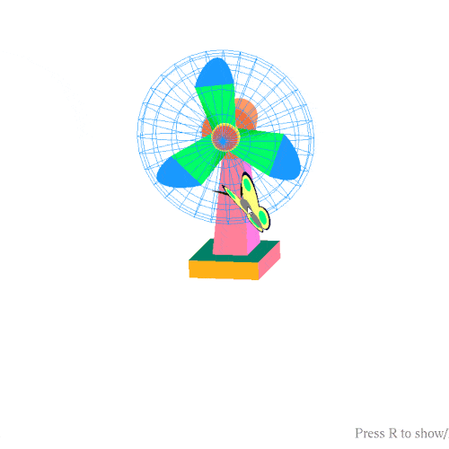

# CGDemo-OpenGL
A mini project for understanding OpenGL (Computer Graphics - Class Assignment) (VTU - BE - 6th Semester) (2015)

> Below model is not designed using tools like 3Ds Max or Blender. Its just **pure C++ code!** :-)

-----

-----
To run this demo, extract Debug.zip

This project is built using Glut - [OpenGL Utility ToolKit](https://www.opengl.org/resources/libraries/glut/)

> [GLut installation instrauctions](https://stackoverflow.com/a/20559229)
-----
## Files
> Structure
+ CGDemo
    + butterfly.h - draws butterfly
    + cgl.h - initializes OpenGL
    + const.h - definition of basic premitives like cube, polygon etc.
    + draw.h -  Custom library to draw basic OpenGl shapes
    + stars.h - draw stars
    + tablefan.h - draw table fan
------
